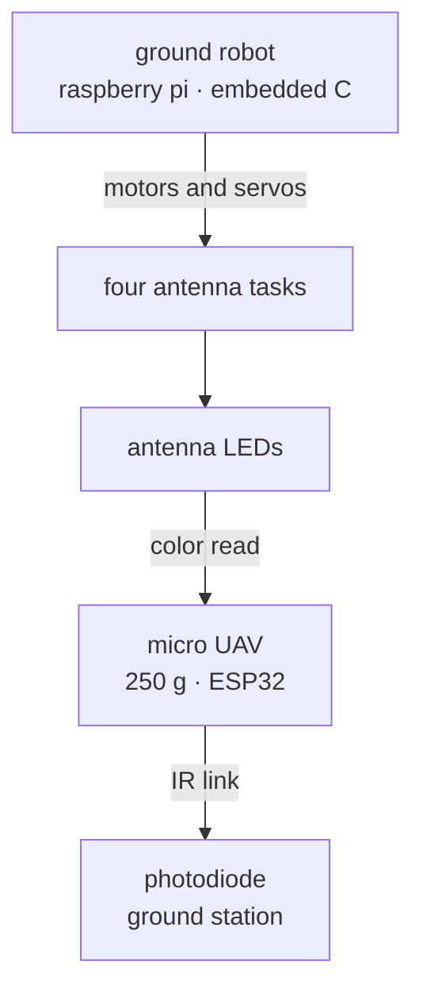

# Joshua Gottus

<samp>robotics and embedded software</samp>

[jr-cho.com](https://jr-cho.com) &nbsp;·&nbsp;
[linkedin](https://linkedin.com/in/jr-cho) &nbsp;·&nbsp;
[github](https://github.com/jr-cho)

> C and C++ on microcontrollers, autonomy on top. 
> Small hardware that has to work on the first try.

Software Lead on Florida Polytechnic's IEEE SoutheastCon hardware 
team. Computer Science, Florida Polytechnic University.

**[SECON27](https://github.com/jr-cho/SECON27)** &nbsp;·&nbsp; `docs` &nbsp;·&nbsp; <samp>current</samp> 
Fully autonomous robot for the SoutheastCon 2027 stock car race. 
Three laps on a 4x8 ft oval, one pit stop to swap tires, a school 
flag raised on the last lap. Three minutes, no external control 
once the match starts. AprilTags mark the assigned pit spot.

**[SECON26](https://github.com/jr-cho/SECON26)** &nbsp;·&nbsp; `c` `c++` `python` 
Ground robot and micro UAV for the SoutheastCon 2026 lunar rescue. 
The robot runs embedded C on a Raspberry Pi through four antenna 
tasks. The 250 g ESP32 UAV reads their LED colors and sends them 
over an IR link to a photodiode ground station.

<samp>system diagram</samp>

**[PRNTSWRM](https://github.com/jr-cho/PRNTSWRM)** &nbsp;·&nbsp; `python` `javascript` `docker` 
Orchestrates print jobs across a mixed 3D printer fleet. Upload a 
sliced file, set a quantity, and a worker hands jobs to whichever 
printers are idle, whether they speak OctoPrint, Bambu, or SDCP.

**[cman](https://github.com/jr-cho/cman)** &nbsp;·&nbsp; `shell` 
C project manager and build orchestrator. Scaffolds a project, 
wires up the build, and drives it from one command instead of a 
pile of CMake invocations you retype every time.

<samp>two smaller ones</samp>

 

**[bump-arena-allocator](https://github.com/jr-cho/bump-arena-allocator)** &nbsp;·&nbsp; `c11` `cmake` 
Bump allocator in C11. An allocation is a pointer add and a bounds 
check. It moves one offset forward and never frees a single object. 
Reclaim the whole block at once with `arena_reset`.

**[CV-Color-Tracker](https://github.com/jr-cho/CV-Color-Tracker)** &nbsp;·&nbsp; `python` 
Tracks a color in a live camera feed. Built to try out ways of 
reading the LED indicators on the SoutheastCon 2026 antenna tasks 
before that code moved onto the robot.

<samp>embedded &nbsp; c &nbsp; c++ &nbsp; esp32 &nbsp; raspberry pi</samp> 
<samp>robotics &nbsp; motor and servo control &nbsp; i2c &nbsp; ardupilot &nbsp; px4 &nbsp; ir comms &nbsp; computer vision</samp> 
<samp>systems &nbsp; linux &nbsp; cmake &nbsp; make &nbsp; docker &nbsp; podman &nbsp; git &nbsp; github runners</samp> 
<samp>also &nbsp; python &nbsp; go &nbsp; typescript &nbsp; nix</samp> 
<samp>editor &nbsp; neovim &nbsp; tmux</samp>
